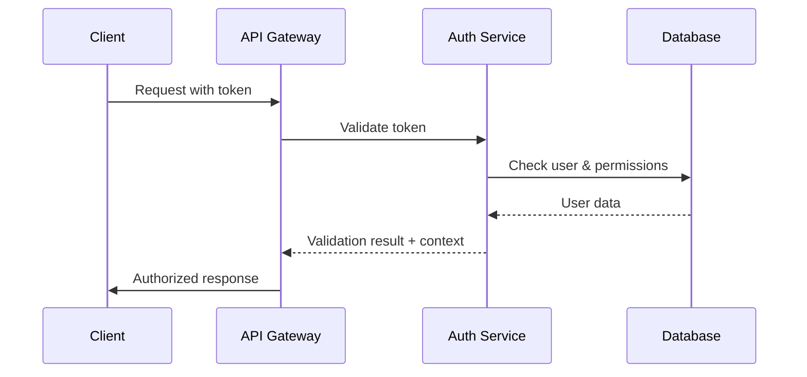

# Open-CSMS - Architecture Design Document

**Version:** 1.0  
**Date:** 2025-01-07  
**Status:** Draft

---

## 1. Architecture Overview

### 1.1 Architecture Philosophy
Open-CSMS adopts a **modular hybrid architecture** that balances:
- **Transactional consistency** for core business operations (monolith)
- **Scalability and maintainability** for peripheral services (microservices)
- **Operational simplicity** for small CPO deployments
- **Enterprise scalability** for SaaS multi-tenant platforms

### 1.2 High-Level Architecture

```
┌─────────────────────────────────────────────────────────────┐
│                    EXTERNAL INTERFACES                     │
├─────────────────┬─────────────────┬─────────────────────────┤
│ Charging        │ OCPI Partners   │ Third-Party             │
│ Stations        │ (CPOs/MSPs)     │ Integrations            │
│ (OCPP 1.6/2.0.1)│ (OCPI 2.2.1)    │ (GraphQL/REST/WS)       │
└─────────────────┴─────────────────┴─────────────────────────┘
                             │
┌─────────────────────────────────────────────────────────────┐
│                    API GATEWAY LAYER                       │
│  ┌─────────────┬─────────────┬─────────────┬─────────────┐  │
│  │ OCPP        │ OCPI        │ GraphQL     │ WebSocket   │  │
│  │ WebSocket   │ REST API    │ API         │ Real-time   │  │
│  │ Handler     │ Handler     │ Handler     │ Dashboard   │  │
│  └─────────────┴─────────────┴─────────────┴─────────────┘  │
└─────────────────────────────────────────────────────────────┘
                             │
┌─────────────────────────────────────────────────────────────┐
│                   CORE BUSINESS LAYER                      │
│                    (Monolithe modulaire)                   │
│  ┌─────────────┬─────────────┬─────────────┬─────────────┐  │
│  │ Station     │ Session     │ User &      │ OCPI Hub    │  │
│  │ Management  │ Management  │ Auth        │ Management  │  │
│  │ Module      │ Module      │ Module      │ Module      │  │
│  └─────────────┴─────────────┴─────────────┴─────────────┘  │
│  ┌─────────────┬─────────────┬─────────────┬─────────────┐  │
│  │ Billing &   │ Tariff      │ Transaction │ Multi-Tenant│  │
│  │ CDR         │ Engine      │ Engine      │ Manager     │  │
│  │ Module      │ Module      │ Module      │ Module      │  │
│  └─────────────┴─────────────┴─────────────┴─────────────┘  │
└─────────────────────────────────────────────────────────────┘
                             │
┌─────────────────────────────────────────────────────────────┐
│                   SERVICES LAYER                           │
│                 (Services découplés)                       │
│  ┌─────────────┬─────────────┬─────────────┬─────────────┐  │
│  │ Analytics   │ Notification│ Monitoring  │ Backup      │  │
│  │ Service     │ Service     │ Service     │ Service     │  │
│  │ (Optional)  │ (Email/SMS) │ & Health    │ & Archive   │  │
│  └─────────────┴─────────────┴─────────────┴─────────────┘  │
└─────────────────────────────────────────────────────────────┘
                             │
┌─────────────────────────────────────────────────────────────┐
│                    DATA LAYER                              │
│                  (Polyglotte spécialisé)                   │
│  ┌─────────────┬─────────────┬─────────────┬─────────────┐  │
│  │ PostgreSQL  │ InfluxDB    │ Redis       │ File        │  │
│  │ Business    │ Telemetry   │ Cache &     │ Storage     │  │
│  │ Data        │ Time-Series │ Sessions    │ (Optional)  │  │
│  └─────────────┴─────────────┴─────────────┴─────────────┘  │
└─────────────────────────────────────────────────────────────┘
```

---

## 2. Component Architecture

### 2.1 Core Business Layer Components

#### 2.1.1 Station Management Module
**Responsibilities:**
- OCPP connection management (WebSocket persistent connections)
- Station configuration and parameter management
- Connector management (Type2, CCS, CHAdeMO)
- Firmware update orchestration
- Real-time status monitoring
- Command queue management with retry logic

**Key Classes:**
```java
@Component
public class StationManager {
    // OCPP connection lifecycle
    // Configuration management
    // Command dispatching
}

@Entity
public class ChargingStation {
    // Station metadata and configuration
    // Multi-connector support
    // Status and capabilities
}

@Service
public class OCPPMessageHandler {
    // Protocol-specific message processing
    // Version-agnostic command handling
}
```

#### 2.1.2 Session Management Module
**Responsibilities:**
- Charging session lifecycle (start/stop/pause)
- Real-time energy measurement collection
- Transaction state management
- Session interruption and recovery
- CDR (Charge Detail Record) generation

**Key Classes:**
```java
@Entity
public class ChargingSession {
    // Session metadata and state
    // Multi-tenant isolation
    // Transaction integrity
}

@Service
public class SessionOrchestrator {
    // Session state machine
    // Recovery mechanisms
    // Real-time updates
}

@Component
public class MeteringCollector {
    // Telemetry data collection
    // InfluxDB integration
    // Real-time streaming
}
```

#### 2.1.3 User & Authentication Module
**Responsibilities:**
- Multi-provider authentication (OIDC, SAML, LDAP)
- RFID token management
- Authorization and RBAC
- User group management
- Roaming partner integration

**Key Classes:**
```java
@Service
public class AuthenticationService {
    // Multi-provider auth integration
    // Token validation
    // Session management
}

@Entity
public class User {
    // Multi-tenant user management
    // Group associations
    // Authentication methods
}

@Component
public class RFIDManager {
    // RFID token lifecycle
    // Multi-format support
    // Roaming integration
}
```

#### 2.1.4 OCPI Hub Management Module
**Responsibilities:**
- OCPI 2.2.1 protocol implementation
- Multi-CPO network management
- Location and tariff synchronization
- Cross-network billing settlement
- Hub routing and message transformation

**Key Classes:**
```java
@RestController
public class OCPIController {
    // OCPI 2.2.1 endpoints
    // Authentication and authorization
    // Data transformation
}

@Service
public class HubOrchestrator {
    // Multi-CPO coordination
    // Message routing
    // Conflict resolution
}

@Entity
public class OCPIPartner {
    // Partner configuration
    // Endpoint management
    // Credential management
}
```

### 2.2 Services Layer Components

#### 2.2.1 Analytics Service (Optional)
```java
@Service
public class AnalyticsService {
    // Business intelligence
    // Predictive analytics
    // Performance metrics
    // Custom reporting
}
```

#### 2.2.2 Notification Service
```java
@Service
public class NotificationService {
    // Multi-channel notifications
    // Email, SMS, webhook integration
    // Alert management
    // Template engine
}
```

#### 2.2.3 Monitoring & Health Service
```java
@Component
public class HealthMonitor {
    // System health checks
    // Performance monitoring
    // Alerting integration
    // Metrics collection
}
```

---

## 3. Data Architecture

### 3.1 PostgreSQL Schema Design

#### 3.1.1 Multi-Tenant Structure
```sql
-- Core tenant management
CREATE TABLE tenants (
    id UUID PRIMARY KEY DEFAULT gen_random_uuid(),
    name VARCHAR(255) NOT NULL,
    domain VARCHAR(255) UNIQUE,
    settings JSONB,
    created_at TIMESTAMP DEFAULT NOW(),
    updated_at TIMESTAMP DEFAULT NOW()
);

-- Multi-tenant base pattern
CREATE TABLE charging_stations (
    id UUID PRIMARY KEY DEFAULT gen_random_uuid(),
    tenant_id UUID NOT NULL REFERENCES tenants(id),
    station_id VARCHAR(255) NOT NULL,
    name VARCHAR(255),
    location JSONB,
    configuration JSONB,
    status VARCHAR(50),
    created_at TIMESTAMP DEFAULT NOW(),
    updated_at TIMESTAMP DEFAULT NOW(),
    UNIQUE(tenant_id, station_id)
);

CREATE INDEX idx_stations_tenant ON charging_stations(tenant_id);
CREATE INDEX idx_stations_status ON charging_stations(tenant_id, status);
```

#### 3.1.2 Core Business Entities
```sql
-- Users with multi-auth support
CREATE TABLE users (
    id UUID PRIMARY KEY DEFAULT gen_random_uuid(),
    tenant_id UUID NOT NULL REFERENCES tenants(id),
    email VARCHAR(255),
    external_id VARCHAR(255),
    auth_provider VARCHAR(50),
    user_groups JSONB,
    preferences JSONB,
    created_at TIMESTAMP DEFAULT NOW(),
    UNIQUE(tenant_id, email),
    UNIQUE(tenant_id, external_id, auth_provider)
);

-- RFID and authentication tokens
CREATE TABLE auth_tokens (
    id UUID PRIMARY KEY DEFAULT gen_random_uuid(),
    tenant_id UUID NOT NULL REFERENCES tenants(id),
    user_id UUID REFERENCES users(id),
    token_type VARCHAR(50), -- RFID, NFC, QR, ISO15118
    token_value VARCHAR(255),
    expires_at TIMESTAMP,
    is_active BOOLEAN DEFAULT true,
    UNIQUE(tenant_id, token_value, token_type)
);

-- Charging sessions
CREATE TABLE charging_sessions (
    id UUID PRIMARY KEY DEFAULT gen_random_uuid(),
    tenant_id UUID NOT NULL REFERENCES tenants(id),
    station_id UUID NOT NULL REFERENCES charging_stations(id),
    user_id UUID REFERENCES users(id),
    connector_id INTEGER NOT NULL,
    session_id VARCHAR(255),
    start_timestamp TIMESTAMP,
    end_timestamp TIMESTAMP,
    start_value DECIMAL(10,3),
    end_value DECIMAL(10,3),
    status VARCHAR(50),
    billing_data JSONB,
    created_at TIMESTAMP DEFAULT NOW()
);

CREATE INDEX idx_sessions_tenant_station ON charging_sessions(tenant_id, station_id);
CREATE INDEX idx_sessions_user ON charging_sessions(tenant_id, user_id);
CREATE INDEX idx_sessions_status ON charging_sessions(tenant_id, status);
```

#### 3.1.3 OCPI Hub Schema
```sql
-- OCPI Partners
CREATE TABLE ocpi_partners (
    id UUID PRIMARY KEY DEFAULT gen_random_uuid(),
    tenant_id UUID NOT NULL REFERENCES tenants(id),
    partner_code VARCHAR(10) NOT NULL,
    name VARCHAR(255),
    role VARCHAR(50), -- CPO, MSP, HUB
    endpoints JSONB,
    credentials JSONB,
    is_active BOOLEAN DEFAULT true,
    UNIQUE(tenant_id, partner_code)
);

-- OCPI Locations (synchronized)
CREATE TABLE ocpi_locations (
    id UUID PRIMARY KEY DEFAULT gen_random_uuid(),
    tenant_id UUID NOT NULL REFERENCES tenants(id),
    partner_id UUID REFERENCES ocpi_partners(id),
    location_id VARCHAR(255),
    location_data JSONB,
    last_updated TIMESTAMP,
    UNIQUE(tenant_id, partner_id, location_id)
);

-- OCPI Tariffs
CREATE TABLE ocpi_tariffs (
    id UUID PRIMARY KEY DEFAULT gen_random_uuid(),
    tenant_id UUID NOT NULL REFERENCES tenants(id),
    partner_id UUID REFERENCES ocpi_partners(id),
    tariff_id VARCHAR(255),
    tariff_data JSONB,
    valid_from TIMESTAMP,
    valid_to TIMESTAMP,
    UNIQUE(tenant_id, partner_id, tariff_id)
);
```

### 3.2 InfluxDB Schema Design

#### 3.2.1 Telemetry Measurements
```influxql
-- Real-time power measurements
measurement: station_power
tags:
  - tenant_id
  - station_id  
  - connector_id
  - session_id
fields:
  - power_kw (float)
  - voltage_v (float)
  - current_a (float)
  - energy_kwh (float)
  - temperature_c (float)
timestamp: nanosecond precision

-- Session events
measurement: session_events
tags:
  - tenant_id
  - station_id
  - session_id
  - event_type
fields:
  - event_data (json)
  - duration_ms (integer)
timestamp: nanosecond precision
```

### 3.3 Redis Schema Design

#### 3.3.1 Caching Strategy
```redis
-- OCPP WebSocket sessions
ws:session:{station_id} -> {
  connection_id: string,
  last_heartbeat: timestamp,
  message_queue: list,
  session_state: json
}

-- Real-time station status
station:status:{tenant_id}:{station_id} -> {
  status: string,
  connectors: json,
  last_update: timestamp
}

-- Active charging sessions cache
session:active:{tenant_id}:{session_id} -> {
  session_data: json,
  real_time_metrics: json
}

-- OCPI data cache
ocpi:locations:{partner_id} -> json
ocpi:tariffs:{partner_id} -> json
```

---

## 4. Integration Architecture

### 4.1 OCPP Integration Layer

#### 4.1.1 WebSocket Management
```java
@Component
public class OCPPWebSocketHandler extends TextWebSocketHandler {
    
    @Override
    public void afterConnectionEstablished(WebSocketSession session) {
        // Station authentication
        // Session registration in Redis
        // Initial configuration sync
    }
    
    @Override
    public void handleTextMessage(WebSocketSession session, TextMessage message) {
        // Message routing based on OCPP version
        // Async processing with CompletableFuture
        // Response handling with timeout
    }
    
    @Override
    public void afterConnectionClosed(WebSocketSession session, CloseStatus status) {
        // Cleanup Redis session state
        // Mark station as offline
        // Queue pending messages
    }
}
```

#### 4.1.2 Protocol Version Abstraction
```java
public interface OCPPMessageProcessor {
    CompletableFuture<OCPPMessage> processMessage(OCPPMessage message);
    boolean supports(OCPPVersion version);
}

@Component
public class OCPP16MessageProcessor implements OCPPMessageProcessor {
    // OCPP 1.6 specific logic
}

@Component  
public class OCPP20MessageProcessor implements OCPPMessageProcessor {
    // OCPP 2.0.1 specific logic
}
```

### 4.2 OCPI Integration Layer

#### 4.2.1 Hub Architecture
```java
@RestController
@RequestMapping("/ocpi/2.2.1")
public class OCPIHubController {
    
    @GetMapping("/locations")
    public ResponseEntity<OCPILocationList> getLocations(
        @RequestHeader("Authorization") String token,
        @RequestParam(required = false) String date_from,
        @RequestParam(required = false) String date_to) {
        
        // Multi-partner data aggregation
        // Data transformation and normalization
        // Hub-specific business logic
    }
    
    @PostMapping("/sessions/{session_id}/start")
    public ResponseEntity<OCPIResponse> startSession(
        @PathVariable String session_id,
        @RequestBody StartSessionRequest request) {
        
        // Cross-network session initiation
        // Partner routing and selection
        // Transaction coordination
    }
}
```

### 4.3 GraphQL Integration Layer

#### 4.3.1 Schema Design
```graphql
type Query {
  # Station management
  stations(tenantId: ID!): [ChargingStation!]!
  station(id: ID!): ChargingStation
  
  # Session data
  sessions(filter: SessionFilter): [ChargingSession!]!
  realTimeMetrics(stationId: ID!): StationMetrics
  
  # OCPI data
  ocpiPartners: [OCPIPartner!]!
  ocpiLocations(partnerId: ID): [Location!]!
}

type Mutation {
  # Station operations
  sendCommand(stationId: ID!, command: StationCommand!): CommandResult!
  
  # Session management  
  startSession(input: StartSessionInput!): ChargingSession!
  stopSession(sessionId: ID!): ChargingSession!
  
  # Configuration
  updateStationConfig(stationId: ID!, config: StationConfig!): ChargingStation!
}

type Subscription {
  # Real-time updates
  stationStatusUpdates(stationIds: [ID!]): StationStatus!
  sessionUpdates(sessionId: ID!): ChargingSession!
  systemAlerts(severity: AlertSeverity): SystemAlert!
}
```

---

## 5. Security Architecture

### 5.1 Authentication Flow



### 5.2 Multi-Tenant Security

#### 5.2.1 Row-Level Security
```sql
-- Enable RLS on all tenant tables
ALTER TABLE charging_stations ENABLE ROW LEVEL SECURITY;

-- Policy for tenant isolation
CREATE POLICY tenant_isolation ON charging_stations
FOR ALL TO application_role
USING (tenant_id = current_setting('app.current_tenant_id')::UUID);
```

#### 5.2.2 API Security
```java
@Component
public class TenantSecurityFilter implements Filter {
    
    @Override
    public void doFilter(ServletRequest request, ServletResponse response, 
                        FilterChain chain) {
        
        // Extract tenant from JWT token
        String tenantId = extractTenantFromToken(request);
        
        // Set tenant context for RLS
        SecurityContextHolder.getContext()
            .setAuthentication(createTenantAuthentication(tenantId));
            
        chain.doFilter(request, response);
    }
}
```

### 5.3 OCPP Security

#### 5.3.1 Certificate Management
```java
@Service
public class CertificateManager {
    
    public void validateStationCertificate(X509Certificate cert) {
        // Certificate chain validation
        // Revocation checking (OCSP)
        // Custom validation rules
    }
    
    public void rotateCertificate(String stationId) {
        // Generate new certificate
        // Deploy to station via OCPP
        // Update local certificate store
    }
}
```

---

## 6. Deployment Architecture

### 6.1 Docker Compose Structure

```yaml
version: '3.8'
services:
  app:
    image: open-csms:latest
    environment:
      - SPRING_PROFILES_ACTIVE=production
      - DATABASE_URL=jdbc:postgresql://postgres:5432/opencsms
      - REDIS_URL=redis://redis:6379
      - INFLUXDB_URL=http://influxdb:8086
    depends_on:
      - postgres
      - redis
      - influxdb
    ports:
      - "8080:8080"
      - "8443:8443"
    
  postgres:
    image: postgres:15
    environment:
      - POSTGRES_DB=opencsms
      - POSTGRES_USER=opencsms
      - POSTGRES_PASSWORD=${DB_PASSWORD}
    volumes:
      - postgres_data:/var/lib/postgresql/data
      
  redis:
    image: redis:7-alpine
    volumes:
      - redis_data:/data
      
  influxdb:
    image: influxdb:2.7
    environment:
      - INFLUXDB_DB=telemetry
      - INFLUXDB_ADMIN_USER=admin
      - INFLUXDB_ADMIN_PASSWORD=${INFLUX_PASSWORD}
    volumes:
      - influx_data:/var/lib/influxdb2
      
  nginx:
    image: nginx:alpine
    ports:
      - "80:80"
      - "443:443"
    volumes:
      - ./nginx.conf:/etc/nginx/nginx.conf
      - ./ssl:/etc/ssl/certs
    depends_on:
      - app

volumes:
  postgres_data:
  redis_data:
  influx_data:
```

### 6.2 Configuration Management

#### 6.2.1 Application Configuration
```yaml
# application-production.yml
spring:
  datasource:
    url: ${DATABASE_URL}
    hikari:
      maximum-pool-size: 20
      
  data:
    redis:
      url: ${REDIS_URL}
      
influxdb:
  url: ${INFLUXDB_URL}
  token: ${INFLUXDB_TOKEN}
  
opencsms:
  multi-tenant:
    enabled: true
    default-tenant: system
    
  ocpp:
    websocket:
      max-connections: 10000
      heartbeat-interval: 60s
      
  ocpi:
    hub-mode: true
    endpoints:
      base-url: https://${DOMAIN}/ocpi/2.2.1
```

---

## 7. Performance Architecture

### 7.1 Scaling Strategy

#### 7.1.1 Horizontal Scaling
```java
@Configuration
@EnableWebSocketMessageBroker
public class WebSocketConfig implements WebSocketMessageBrokerConfigurer {
    
    @Override
    public void configureMessageBroker(MessageBrokerRegistry config) {
        // Redis-backed message broker for clustering
        config.enableStompBrokerRelay("/topic", "/queue")
              .setRelayHost("redis")
              .setRelayPort(6379);
    }
}
```

#### 7.1.2 Caching Strategy
```java
@Service
@CacheConfig(cacheNames = "stations")
public class StationService {
    
    @Cacheable(key = "#tenantId + '_' + #stationId")
    public ChargingStation getStation(UUID tenantId, String stationId) {
        // Database lookup with Redis caching
    }
    
    @CacheEvict(key = "#station.tenantId + '_' + #station.stationId")
    public void updateStation(ChargingStation station) {
        // Update with cache invalidation
    }
}
```

### 7.2 Monitoring Integration

#### 7.2.1 Metrics Collection
```java
@Component
public class MetricsCollector {
    
    @EventListener
    public void onSessionStart(SessionStartEvent event) {
        // Increment active sessions counter
        Metrics.counter("sessions.started", 
                      "tenant", event.getTenantId())
               .increment();
    }
    
    @Scheduled(fixedDelay = 30000)
    public void collectSystemMetrics() {
        // JVM metrics, database connections, etc.
    }
}
```

---

## Next Steps

Cette architecture fournit la foundation technique pour open-csms. Les prochaines étapes sont :

1. **Détailler les modèles de données** (entités JPA complètes)
2. **Spécifier les APIs** (OpenAPI/GraphQL schemas)
3. **Architecture de sécurité avancée** (PKI, certificates)
4. **Plan de déploiement** (CI/CD, monitoring)

Veux-tu que je continue avec une section spécifique ou passer à la **phase 3 (plan de développement)** ?